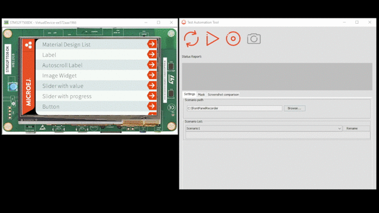

.. ReStructuredText
.. Copyright 2021 MicroEJ Corp. All rights reserved.
.. This library is provided in source code for use, modification and test, subject to license terms.
.. Any modification of the source code will break MicroEJ Corp. warranties on the whole library.

.. image:: https://shields.microej.com/endpoint?url=https://repository.microej.com/packages/badges/sdk_5.7.json
   :alt: sdk_5.7 badge
   :align: left

.. image:: https://shields.microej.com/endpoint?url=https://repository.microej.com/packages/badges/gui_3.json
   :alt: gui_3 badge
   :align: left

==========
 Overview
==========

This repository contains a tool for automated GUI testing and a library for using this tool with JUnit.

Please refer to the module README for more information on the tool: `README.md <TestAutomationTool/README.md>`_

Please refer to the module README for more information on the Junit library: `README.md <TestAutomationJUnitLibrary/README.md>`_
