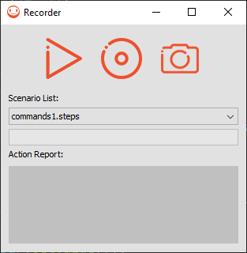

# Overview

This repository provides an automated tool for UI testing.  It is used to record scenario of events (on `Pointer` and `Button`) and replay the scenario. While replaying a scenario, this tool can also compare the screen with screenshots captured while recording scenario.



# Architecture

This module extends the classes `Pointer` and `Button` of the `FrontPanel` then the tool overrides its events and adds a recording step before sending the event to the MicroEJ Application. It can also capture a screenshot so when the user replays it, they will have a point to compare the current screen with the screen captured during the recording process. The screen capture process stores the current displayed pixels in a .raw file.
The replay process is done by replicating an event from the `Pointer` or `Button` by getting the widget by its label name and calling the event recorded.

# Usage

## Run on MicroEJ Simulator

- Add the following line to the platform-fp's `module.ivy`:

   ```xml
       <dependency org="ej.tool.frontpanel" name="fp-test-automation-tool" rev="2.0.0"/>
   ```
- Update the Front Panel file(s) (`.fp` in `src/main/resources`) to record and simulate `Pointer` and `Button` events:

  - Replace `ej.fp.widget.Pointer` by `ej.fp.widget.recorder.RecorderPointer`.

  - Replace `ej.fp.widget.Button` by `ej.fp.widget.recorder.RecorderButton`.

- Build the platform-configuration project.

- Update the application launchers to use the new platform.

### Recording

To record a scenario press the record button (center button). All triggered events within the Display (and `RecorderButton` if used) are recorded. Click on the screenshot button (right button) to take a screenshot for comparison while recording.

All the files are stored under `$USER_HOME/.microej/frontPanelRecorder` in subfolders representing their timestamp of creation. The following files are available:
  - `scenario.steps` contains all the commands recorded.
  - `screenshotTIMESTAMP.raw` are screenshot images taken when recording.
  - `testTIMESTAMP.report` are the reports generated after the execution of the scenario.

The `.raw` format is a raw bytes file that stores all the pixels in sequence. They are store in order `Alpha`, `Red`, `Green` and `Blue`. `Alpha` is the transparency component of each pixel, `Red` is the red component, `Green` is the green component and `Blue` is the blue component.
The `testTIMESTAMP.report` files has the results of all screenshot comparisons, it can have two results:
  - Screen test number TIMESTAMP ended with success.
  - Screen test number TIMESTAMP ended with with fail exiting player.
When a test fails it will stop execution of the player so it will not have the result message of any tests after the failed one.

### Playing

To play a scenario:
- Select a scenario from the `Scenario List` (below the buttons)
- Press the play button (left button) to play the selected scenario

# Requirements

- Java SE 8.
- UI Pack 13.0.0 or higher.

# Dependencies

_All dependencies are retrieved transitively by MicroEJ Module Manager_.

# Restrictions

Cannot be used on embedded devices.

# Known limitations

- The tool can, and most likely will, display incorrect test results if animations are involved, the best solution for this is to avoid animations by waiting for the animation to completely end before making any other actions while recording. 
- Scroll animations in particular will cause a test to fail almost every time.  To avoid the scroll animation, either wait a little before releasing the pointer after a drag or set the animation time to 0.

---  
_Markdown_   
_Copyright 2021 MicroEJ Corp. All rights reserved._
_This library is provided in source code for use, modification and test, subject to license terms._
_Any modification of the source code will break MicroEJ Corp. warranties on the whole library._