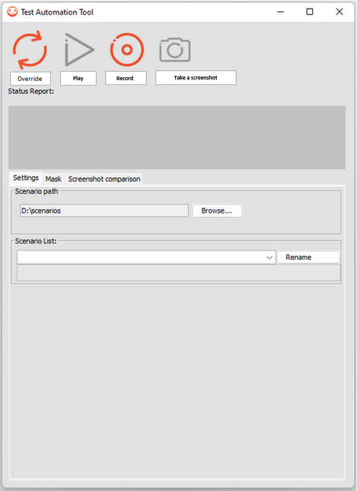

# Overview

This repository provides an automated tool for UI testing.

It is used to record scenario of events (on `Pointer` , `Button` , `LongButton` and `Joystick`) and replay the scenario. While replaying a scenario, this tool can also compare the screen with screenshots captured while recording scenario.

Scenario can be stored in a custom path or a default path specified in application properties.



# Architecture

This module extends the classes `Pointer` , `Button` , `LongButton` and `Joystick` of the `FrontPanel`. It overrides the FrontPanel events and adds a recording step before sending the event to the MicroEJ Application. 

The tool can capture screenshots while recording a scenario. This allows to perform screen comparison during a scenario replay.
Screenshots are saved in .png format.

The replay process is done by replicating an event from the `Pointer` or `Button` or `LongButton` or `Joystick` event recorded.

# Usage

## Run on MicroEJ Simulator

- Add the following line to the platform-fp's `module.ivy`:

   ```xml
       <dependency org="ej.tool.frontpanel" name="fp-test-automation-tool" rev="2.3.0"/>
   ```
- Update the Front Panel file(s) (`.fp` in `src/main/resources`) to record and simulate `Pointer` , `Button` and `LongButton` events:

  - Replace `ej.fp.widget.Pointer` by `ej.fp.widget.recorder.RecorderPointer`.

  - Replace `ej.fp.widget.Button` by `ej.fp.widget.recorder.RecorderButton`.

  - Replace `ej.fp.widget.LongButton` by `ej.fp.widget.recorder.RecorderLongButton`.
  - Replace `ej.fp.widget.Joystick` by `ej.fp.widget.recorder.Joystick`.

- Build the platform-configuration project.

- Update the application launchers to use the new platform.

- Add the following line to the `common.properties` file of the application to specify the recording default folder:

   ```
       mock.ej.library.test.path=${launcher.properties.dir}/../src/test/tat
   ```

### Recording

To record a scenario press the ``Record`` button. All triggered events are recorded. 
Click on the ``Screenshot`` button to take a screenshot. The screenshot will be compared to the application screen when replaying the scenario.

Recorded scenarios are stored under `$USER_HOME/.microej/frontPanelRecorder` by default.

The property `mock.ej.library.test.path` can be set to define a custom folder:
- The property must be set in an application property file (e.g. `build/common.properties`).
- For example, set the property as follows to store the recorded scenario in the `src/test/tat/` folder of the application project:
  - `mock.ej.library.test.path=${launcher.properties.dir}/../src/test/tat` 

The following files are available:
  - `scenario.steps` contains all the commands recorded.
  - `screenshotTIMESTAMP.png` are screenshot images taken when recording.
  - `testTIMESTAMP.report` are the reports generated after the execution of the scenario.

The `testTIMESTAMP.report` files stores the results of all screenshot comparisons, it can have two results:
  - Screen test number TIMESTAMP ended with success.
  - Screen test number TIMESTAMP ended with with fail exiting player.

When a test fails it will stop the execution of the player.

### Playing

To play a scenario:
- Select a scenario from the `Scenario List`,
- Press the ``Play`` button to play the selected scenario.

### Override Mode

The override mode can be used to automatically replace recorded screenshots with new ones while replaying a scenario.

To override the screenshots of a scenario:
- Select a scenario from the `Scenario List`.
- Press the ``Override`` button to override the selected scenario screenshots.

### Mask Mode

The mask mode can be used to mask a screen area before taking a screenshot (e.g. hide the time as it changes permanently).

The following features are available:
- Add one or more masks on the same screenshot.
- Give a name to each mask.
- Choose the mask color through a color choice list.
- Add, delete or rename a mask.

To set the screenshot Mask:
- Check `Enable mask`.
- Enter the mask coordinates and size.
- While recording, click on the screenshot button to take a screenshot with the mask parameters. The Mask settings will be stored in the `.steps` file.

Note: the recording can be paused using the pause button while setting the mask parameters.

### Update recording path

To update the recording path:
- Press the ``Browse...`` button.
- Select the folder where to store scenarios.

# Requirements

- Java SE 8.
- UI Pack 13.0.0 or higher.

# Dependencies

_All dependencies are retrieved transitively by MicroEJ Module Manager_.

# Restrictions

Cannot be used on embedded devices.

# Known limitations

- The tool can, and most likely will, display incorrect test results if animations are involved, the best solution for this is to avoid animations by waiting for the animation to completely end before making any other actions while recording. 
- Scroll animations in particular will cause a test to fail almost every time.  To avoid the scroll animation, either wait a little before releasing the pointer after a drag or set the animation time to 0.

---  
_Markdown_   
_Copyright 2021-2023 MicroEJ Corp. All rights reserved._
_Use of this source code is governed by a BSD-style license that can be found with this software._